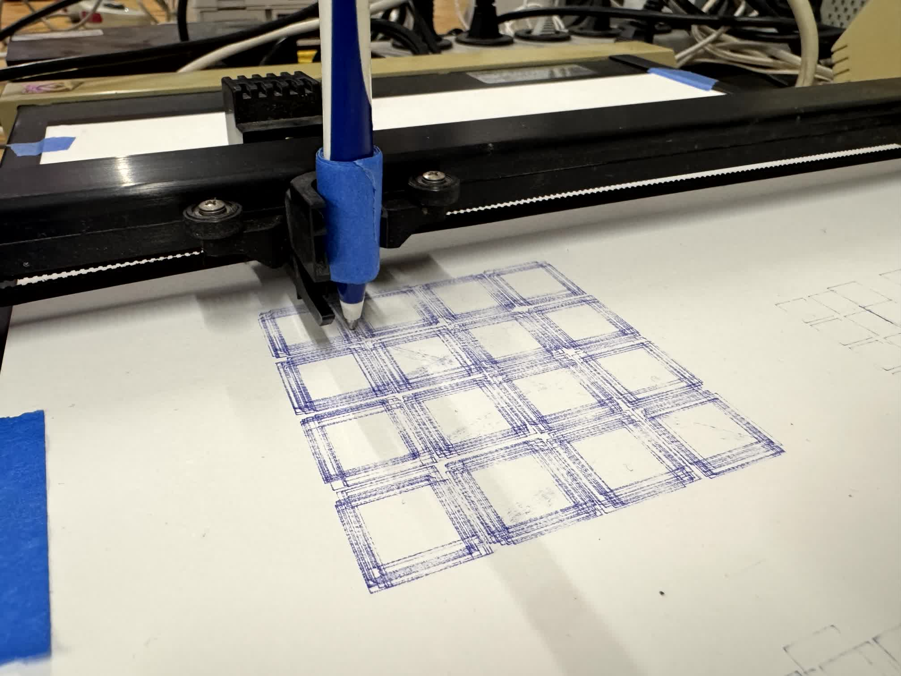
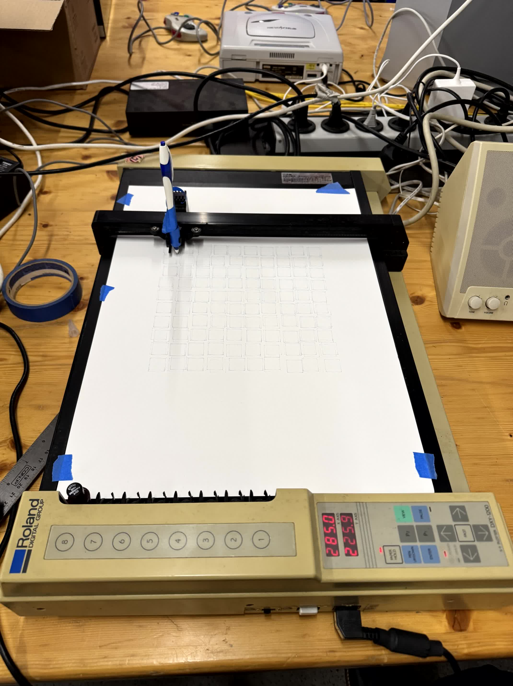
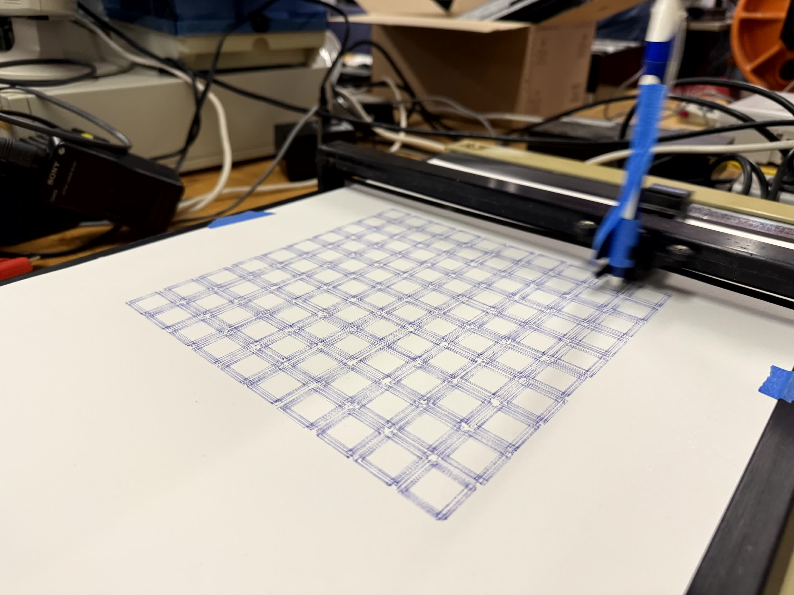
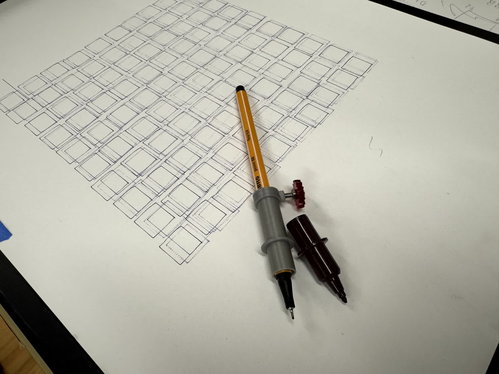

# Roland DXY-1200 · Pen Plotter

Tests with the Roland pen plotter DXY-1200. The plotter has, on the underside, a few DIP switches to set the input language and the communication mode.

By setting it to DXY-GL, the commands can be sent to the plotter via LPT1 (the parallel port). The plotter will then execute the commands and draw the lines on the paper. In the [Manual](https://archive.org/details/03PandasAndPlotting/mode/1up) the command set is described in detail.

## Source

An old DOS/Windows computer is enough to send commands to the plotter. There is a test file [`plott-center.dxy`](src/plott-center.dxy) that moves the pen and then draws a line. The file can be sent to the plotter with the `COPY` command in the terminal:

```
COPY /b plott-center.dxy LPT1
```

For generative drawings, it's also possible to use QBASIC (see the example in [`plott-qbasic.bas`](src/plott-qbasic.bas)) to generate the commands and send them to the plotter. See [`plott-qbasic.bas.txt`](src/plott-qbasic.bas.txt) for a plain-text version of the code.

## Impressions







## License

MIT License. Coded by [Matthias Schwyn](https://www.weisspunkt.ch/) and [Stefan Huber](https://signalwerk.ch/).
